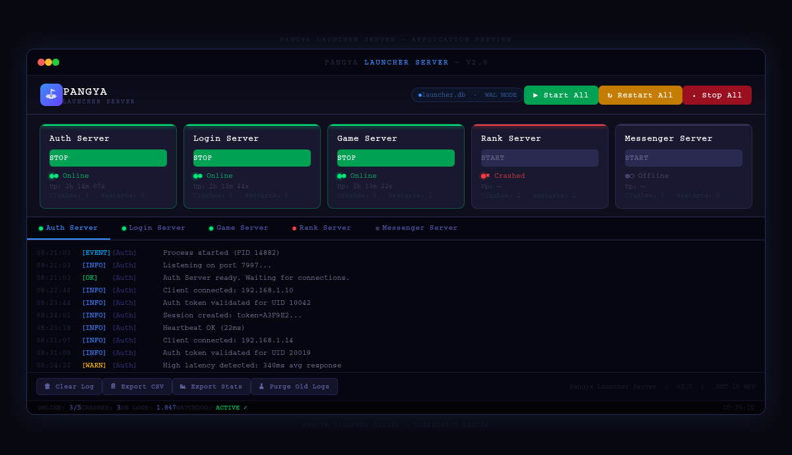

# Pangya Launcher Server v2.0

WPF application (.NET 10, Windows) that manages the full suite of Pangya private-server processes from a single dashboard.



---

## Features

| Feature | Details |
|---|---|
| **Process management** | Start / Stop / Restart per server or all at once |
| **Auto-start** | Mark servers with `Run="true"` in `startup.xml` |
| **Auto-restart** | Configurable crash-restart with exponential back-off (2 s → 4 s → 8 s … 30 s cap) |
| **MaxRestarts** | Per-server ceiling; set `0` for unlimited |
| **Watchdog** | Background timer (every 5 s) detects silent crashes |
| **Live logs** | Per-server colour-coded console — Info (green), Warn (yellow), Error (red), Event (blue) |
| **Uptime counter** | Live hh:mm:ss uptime per server card |
| **Crash counter** | Crash / restart tally shown on each card |
| **SQLite database** | All log lines and lifecycle events persisted to `launcher.db` |
| **Log export (CSV)** | Export any server's log to a CSV file |
| **Stats export** | Overall stats report (starts / crashes / restart rate) |
| **Log purge** | One-click purge of entries older than 30 days |
| **Confirm on exit** | Prompts to stop all servers before closing |

---

## Project structure

```
PangyaLauncherServer.sln
├── LauncherServer/
│   ├── Models/
│   │   ├── ServerEntry.cs          — config + runtime state model
│   │   ├── LogEntry.cs             — persisted log line
│   │   └── ServerStats.cs          — aggregated DB statistics
│   ├── Database/
│   │   └── DatabaseService.cs      — SQLite (WAL mode), logs + events
│   ├── Services/
│   │   ├── ServerManager.cs        — process lifecycle orchestrator
│   │   └── LogExportService.cs     — CSV / TXT / stats export
│   ├── Helpers/
│   │   ├── ServerConfiguration.cs  — XML config loader / saver
│   │   └── UiHelper.cs             — WPF colour / format utilities
│   ├── MainWindow.xaml             — UI layout
│   ├── MainWindow.xaml.cs          — UI code-behind
│   ├── App.xaml / App.xaml.cs
│   └── PangyaLauncherServer.csproj
└── startup.xml                     — server process configuration
```

---

## Setup

### Prerequisites
- .NET 10 SDK (or Runtime for end-users)
- Windows 7+ (x64)

### Build
```powershell
cd LauncherServer
dotnet restore
dotnet build -c Release
```

### First run
1. Place `startup.xml` next to the `.exe` (or let the launcher generate a default one).
2. Edit `startup.xml` — set the correct `Path` for each server executable.
3. Run `PangyaLauncherServer.exe`.

---

## startup.xml reference

```xml
<Process
  Name        = "Game"          <!-- must match card x:Name prefix in MainWindow.xaml -->
  Path        = "servers\GameServer.exe"
  Parameters  = ""              <!-- CLI args forwarded to the process -->
  Delay       = "1000"          <!-- ms to wait before launching -->
  Run         = "true"          <!-- auto-start on launcher open -->
  AutoRestart = "true"          <!-- restart on crash -->
  MaxRestarts = "5" />          <!-- 0 = unlimited -->
```

---

## Database (launcher.db)

Two tables are created automatically on first run.

### `Logs`
| Column | Type | Description |
|---|---|---|
| Id | INTEGER PK | Auto-increment |
| ServerName | TEXT | e.g. "Game" |
| Level | TEXT | Info / Warn / Error / Event / Debug |
| Message | TEXT | Raw log line |
| Timestamp | TEXT | `yyyy-MM-dd HH:mm:ss` |

### `ServerEvents`
| Column | Type | Description |
|---|---|---|
| Id | INTEGER PK | Auto-increment |
| ServerName | TEXT | e.g. "Auth" |
| EventType | TEXT | Started / Stopped / Crashed / Restarted |
| Pid | INTEGER | Process ID (nullable) |
| ExitCode | INTEGER | Exit code (nullable) |
| Timestamp | TEXT | `yyyy-MM-dd HH:mm:ss` |

---

## Adding a new server

1. Add a new `<Process>` entry to `startup.xml`.
2. Copy one server card block in `MainWindow.xaml`, rename all `x:Name` prefixes to match the new `Name` attribute (e.g. `"Chat"` → `ChatToggle`, `ChatLog`, `ChatStatus`, `ChatUptime`, `ChatCrashes`).
3. Add a matching `<TabItem>` with a `RichTextBox x:Name="ChatLog"` inside the `TabControl`.
4. No code-behind changes needed — the manager is data-driven.

---

## Exported files

All exports land in a `logs/` folder next to the executable.

| File | Content |
|---|---|
| `log_<Server>_<datetime>.csv` | Full log for one server |
| `log_<Server>_<datetime>.txt` | Same, plain text |
| `stats_<datetime>.txt` | Aggregated event statistics for all servers |

---

## Architecture notes

- **`ServerManager`** is completely decoupled from WPF — it raises C# events; the UI subscribes and marshals via `Dispatcher.InvokeAsync`.
- **`DatabaseService`** uses WAL mode for concurrent reads during writes.
- **`LogExportService`** is a static utility — no state, easy to unit-test.
- **`UiHelper`** centralises all colour/format logic; changing the colour scheme is a single-file edit.
- Process stdout/stderr are streamed asynchronously via `BeginOutputReadLine` — the UI never blocks.
